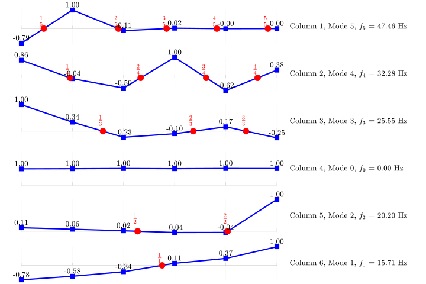

# Sub-Synchronous Resonance (SSR) Modal Analysis Tool


This repository contains a **Sub-Synchronous Resonance (SSR) Modal Analysis Tool** designed for engineers and researchers working in power systems and electrical/mechanical engineering. The function automatically performs modal analysis on a shaft system, computing **state matrix**, **eigenvalues**, and **eigenvectors** based on user input for **inertia constants** and **spring stiffness** of the rotating masses.

The tool identifies critical **torsional modes** and provides visualizations of these modes, helping users understand potential resonance issues and the dynamic behavior of shaft systems under sub-synchronous conditions. This tool is ideal for studies on turbine-generators, electrical machines, and coupled mechanical systems where SSR is a concern.

## 🔑 Key Features
- **Automatic Modal Analysis**: Computes state matrices, eigenvalues, and eigenvectors with minimal user input.
- **Torsional Mode Identification**: Identifies critical torsional modes of the shaft system, including sub-synchronous modes.
- **Visual Mode Plots**: Generates visual plots of torsional modes for clear and easy analysis.
- **Customizable Inputs**: Flexible inputs for the inertia constants of rotating masses and spring stiffness between masses.
- **Optimized for Engineers**: Tailored for mechanical and electrical engineers dealing with shaft system analysis in power systems or rotating machinery.

## 🚀 Usage
The main function takes two primary inputs:
- **Inertia Constants (H)**: The inertia constants of rotating masses on the shaft (in seconds).
- **Spring Stiffness (stiffness)**: The spring stiffness between the rotating masses (in pu [torque/rad]).

### Example Code:
```matlab
% Define inertia constants of rotating masses (H) and spring stiffness (K)
fb = 60;%(Hz)
H = [0.124 , 0.232, 1.155, 1.192, 0.855]; %(s)
stiffness = [21.8, 48.4, 75.6,  62.3,  1.98]; %(pu [torque]/[elec. rad])

torsional_analysis(fb,H,stiffness)
```

### Outputs:
- **Eigenvalues**: The natural frequencies of the system.
- **Eigenvectors**: Corresponding mode shapes of the rotating masses.
- **Plots**: Visual representation of the identified torsional mode shapes.

## 🛠️ Dependencies
- MATLAB

## 🖼️ Visualizations
The tool provides the following visualizations:
- **Mode Shapes**: Graphical representations of the torsional modes.

Example Plot:



## For more information:
- **My Previous File**: (including pdf report) on [](https://www.mathworks.com/matlabcentral/fileexchange/160188-subsynchronous-resonance-ssr?s_tid=prof_contriblnk)
or [
- Kundur, P. (1994). Power System Stability and Control. United States: McGraw-Hill. (https://www.google.fr/books/edition/Power_System_Stability_and_Control/dw1JzwEACAAJ?hl=en)
- "First benchmark model for computer simulation of subsynchronous resonance," in IEEE Transactions on Power Apparatus and Systems, vol. 96, no. 5, pp. 1565-1572, Sept. 1977, doi: 10.1109/T-PAS.1977.32485.(https://doi.org/10.1109/T-PAS.1977.32485)
- R. G. Farmer, A. L. Schwalb and E. Katz, "Navajo project report on subsynchronous resonance analysis and solutions," in IEEE Transactions on Power Apparatus and Systems, vol. 96, no. 4, pp. 1226-1232, July 1977, doi: 10.1109/T-PAS.1977.32445.(https://doi.org/10.1109/T-PAS.1977.32445)
-  Chuang, C.-H., Chiu, B.-K., Lee, K.-Y., Hsu, Y.-Y.: Modal analysis, control of frequency, and torsional modes of microgrid with doubly fed induction generator wind turbines providing frequency support. IET Renew. Power Gener. 17, 2315–2334 (2023). (https://doi.org/10.1049/rpg2.12761)(https://ietresearch.onlinelibrary.wiley.com/doi/10.1049/rpg2.12761)
- Padiyar, K. (2012). Analysis of Subsynchronous Resonance in Power Systems. Switzerland: Springer US. (https://www.google.fr/books/edition/Analysis_of_Subsynchronous_Resonance_in/ogT3BwAAQBAJ?hl=en&gbpv=0)


## 📊 Keywords and Tags
- Sub-Synchronous Resonance
- SSR Analysis
- Torsional Mode Analysis
- State Matrix Computation
- Modal Analysis MATLAB
- Power Systems Dynamics
- Turbine-Generator SSR
- Shaft System Modal Analysis
- Eigenvalues and Eigenvectors
- MATLAB Visualization
- Mechanical Shaft Dynamics
- Rotating Mass Inertia

